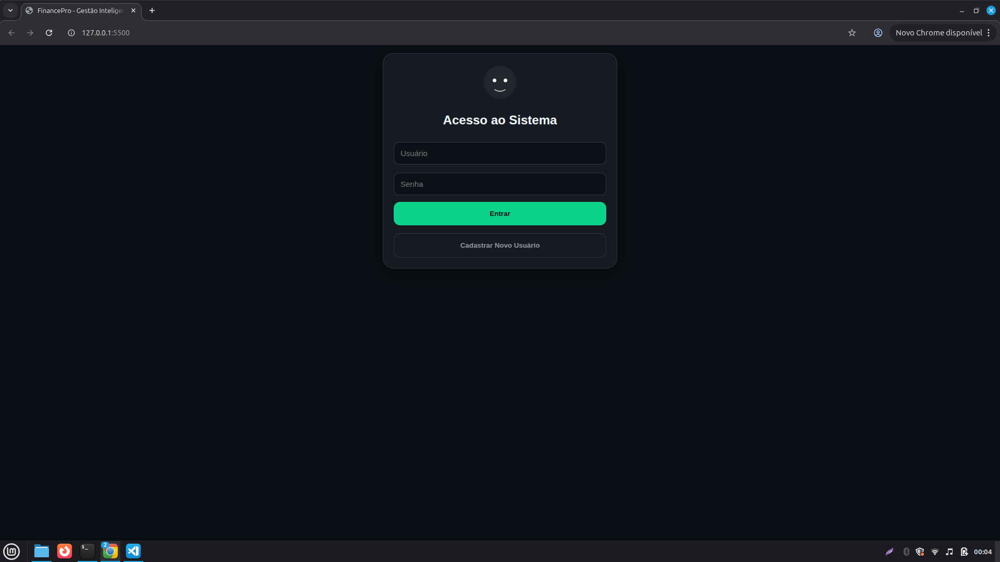
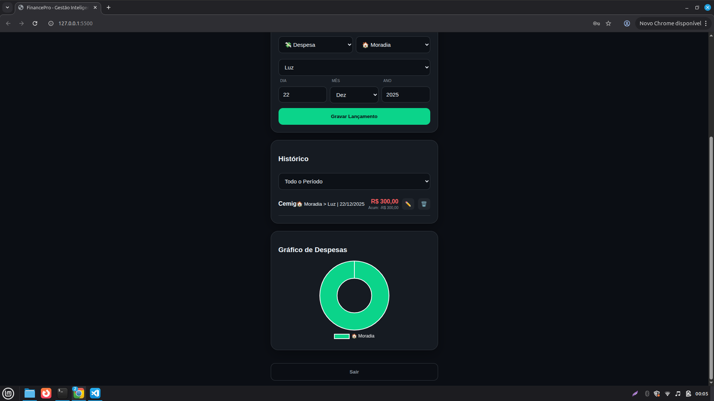

# 💰 FinancePro - Controle Financeiro

Este é um projeto de gerenciamento financeiro pessoal desenvolvido para ser rápido, privado e funcional diretamente no navegador ou celular.

---

## 📸 Demonstração do Sistema

### **Acesso e Segurança**
Interface de autenticação simples e direta. O sistema foca na privacidade, mantendo seus dados salvos localmente.

### **Dashboard Principal**
Visão geral do saldo, receitas e despesas com filtros por período.

### **Gestão de Gastos e Gráficos**
Histórico detalhado de lançamentos com ícones por categoria e gráfico de rosca para análise visual das despesas.

---

## 🚧 Projeto em Construção
> **Aviso:** Este projeto ainda está em fase de criação e desenvolvimento. Algumas funcionalidades podem ser alteradas, aprimoradas ou adicionadas em breve.

---

## ✨ Funcionalidades Atuais
- [x] **Login Persistente:** O usuário fica salvo no dispositivo após o primeiro acesso.
- [x] **Saldo Acumulado:** Cálculo automático de saldo conforme os lançamentos.
- [x] **Categorias Dinâmicas:** Seleção inteligente de categorias e subcategorias.
- [x] **Gráfico de Despesas:** Visualização em gráfico de pizza para entender para onde vai o dinheiro.
- [x] **PWA / Mobile First:** Design otimizado para celulares (pode ser "instalado" na tela inicial).

## 🔒 Privacidade e Dados
Os dados são armazenados localmente no navegador do usuário (`localStorage`). Isso significa que:
1. Ninguém além de você tem acesso aos seus dados.
2. Não é necessário um servidor de banco de dados externo.
3. **Atenção:** Se você limpar o cache do navegador, os dados serão excluídos.

## 🚀 Como Executar
Basta acessar o link gerado pelo GitHub Pages (disponível na aba "Settings > Pages" do repositório).

---
**Desenvolvido por [lmoreira2019](https://github.com/lmoreira2019)**